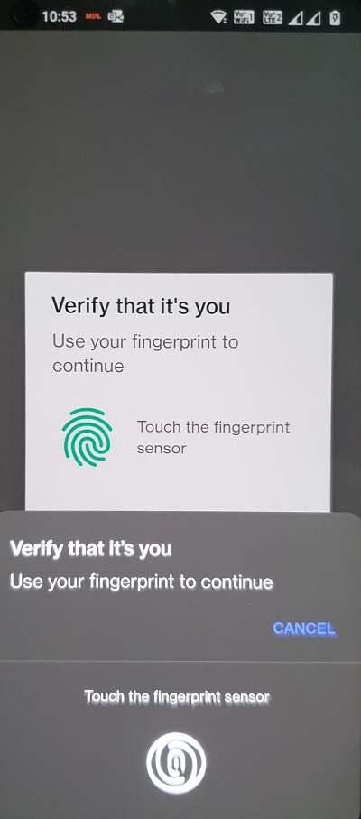
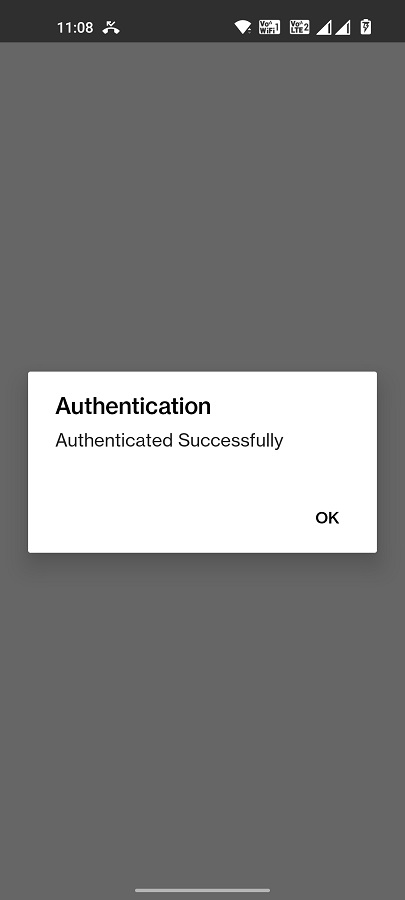

# React Native Biometric Auth Demo

[React Native Touch ID](https://www.npmjs.com/package/react-native-touch-id) is a React Native library for authenticating users with biometric authentication methods like Face ID and Touch ID on both iOS and Android (experimental).

### Demo

| Screenshots |  |  | 
|:---:|:---:|:---:|
|  |  |  |


### Install

```
npm i --save react-native-touch-id
```

or

```
yarn add react-native-touch-id
```

### Linking the Library

```
react-native link react-native-touch-id
```

### Requesting Face ID/Touch ID Authentication

Once you've linked the library, you'll want to make it available to your app by requiring it:

```
import TouchID from 'react-native-touch-id';
```

Requesting Face ID/Touch ID Authentication is as simple as calling:

```
TouchID.authenticate('to demo this react-native component', optionalConfigObject)
  .then(success => {
    // Success code
  })
  .catch(error => {
    // Failure code
  });
```

